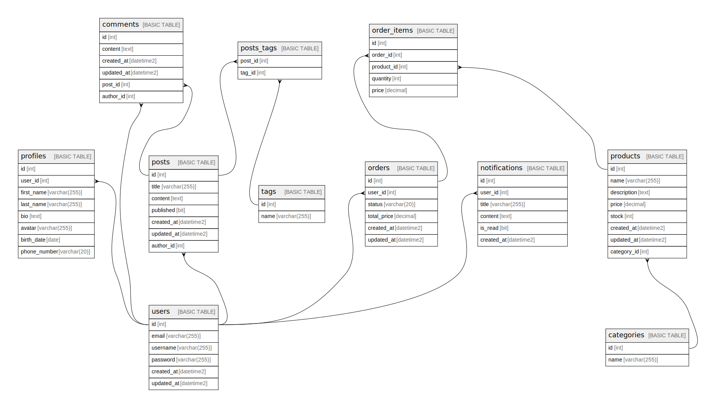

# blog_app

## Tables

| Name | Columns | Comment | Type |
| ---- | ------- | ------- | ---- |
| [users](users.md) | 6 |  | BASIC TABLE |
| [profiles](profiles.md) | 8 |  | BASIC TABLE |
| [posts](posts.md) | 7 |  | BASIC TABLE |
| [comments](comments.md) | 6 |  | BASIC TABLE |
| [tags](tags.md) | 2 |  | BASIC TABLE |
| [posts_tags](posts_tags.md) | 2 |  | BASIC TABLE |
| [categories](categories.md) | 2 |  | BASIC TABLE |
| [products](products.md) | 8 |  | BASIC TABLE |
| [orders](orders.md) | 6 |  | BASIC TABLE |
| [order_items](order_items.md) | 5 |  | BASIC TABLE |
| [notifications](notifications.md) | 6 |  | BASIC TABLE |

## Relations

---

> Generated by [tbls](https://github.com/k1LoW/tbls)
