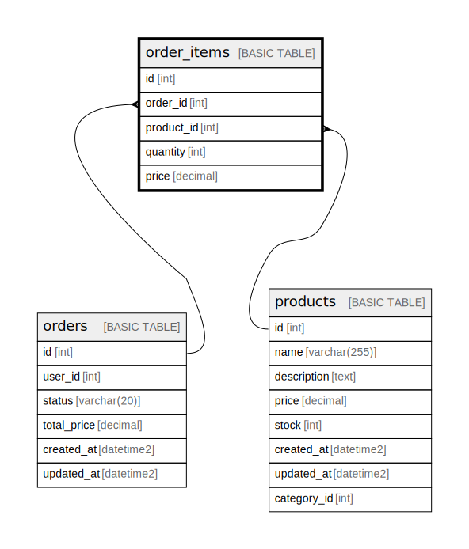

# order_items

## Description

## Columns

| Name | Type | Default | Nullable | Children | Parents | Comment |
| ---- | ---- | ------- | -------- | -------- | ------- | ------- |
| id | int |  | false |  |  |  |
| order_id | int |  | false |  | [orders](orders.md) |  |
| product_id | int |  | false |  | [products](products.md) |  |
| quantity | int |  | false |  |  |  |
| price | decimal |  | false |  |  |  |

## Constraints

| Name | Type | Definition |
| ---- | ---- | ---------- |
| PK__order_it_* | PRIMARY KEY | CLUSTERED, unique, part of a PRIMARY KEY constraint, [ id ] |
| FK__order_ite__order_* | FOREIGN KEY | FOREIGN KEY(order_id) REFERENCES orders(id) ON UPDATE NO_ACTION ON DELETE NO_ACTION |
| FK__order_ite__produ_* | FOREIGN KEY | FOREIGN KEY(product_id) REFERENCES products(id) ON UPDATE NO_ACTION ON DELETE NO_ACTION |

## Indexes

| Name | Definition |
| ---- | ---------- |
| PK__order_it_* | CLUSTERED, unique, part of a PRIMARY KEY constraint, [ id ] |

## Relations

---

> Generated by [tbls](https://github.com/k1LoW/tbls)
