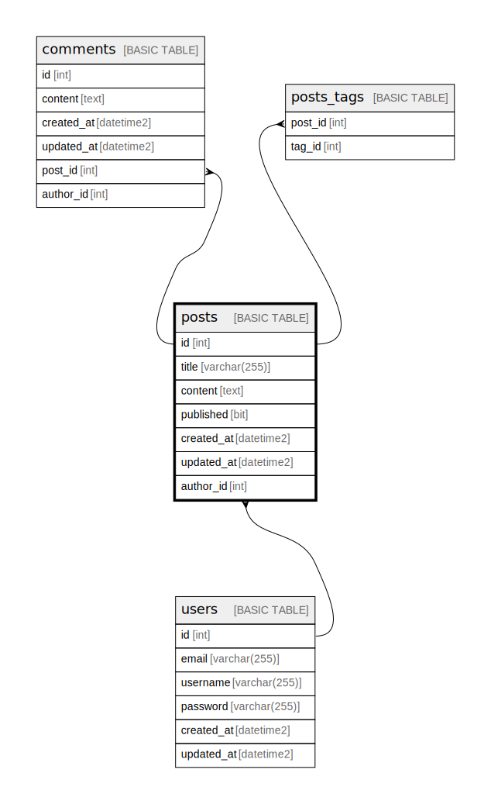

# posts

## Description

## Columns

| Name | Type | Default | Nullable | Children | Parents | Comment |
| ---- | ---- | ------- | -------- | -------- | ------- | ------- |
| id | int |  | false | [comments](comments.md) [posts_tags](posts_tags.md) |  |  |
| title | varchar(255) |  | false |  |  |  |
| content | text |  | false |  |  |  |
| published | bit | ((0)) | true |  |  |  |
| created_at | datetime2 | (getdate()) | true |  |  |  |
| updated_at | datetime2 | (getdate()) | true |  |  |  |
| author_id | int |  | false |  | [users](users.md) |  |

## Constraints

| Name | Type | Definition |
| ---- | ---- | ---------- |
| PK__posts_* | PRIMARY KEY | CLUSTERED, unique, part of a PRIMARY KEY constraint, [ id ] |
| FK__posts__author_id_* | FOREIGN KEY | FOREIGN KEY(author_id) REFERENCES users(id) ON UPDATE NO_ACTION ON DELETE NO_ACTION |

## Indexes

| Name | Definition |
| ---- | ---------- |
| PK__posts_* | CLUSTERED, unique, part of a PRIMARY KEY constraint, [ id ] |

## Relations

---

> Generated by [tbls](https://github.com/k1LoW/tbls)
