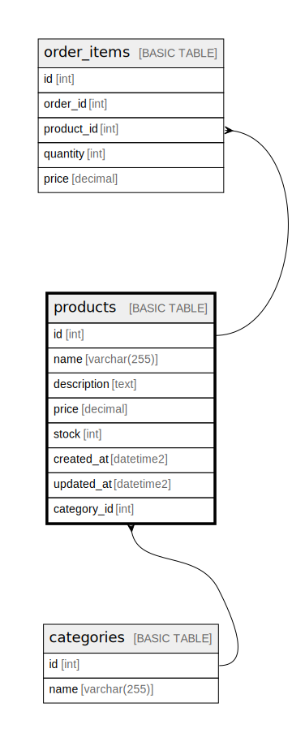

# products

## Description

## Columns

| Name | Type | Default | Nullable | Children | Parents | Comment |
| ---- | ---- | ------- | -------- | -------- | ------- | ------- |
| id | int |  | false | [order_items](order_items.md) |  |  |
| name | varchar(255) |  | false |  |  |  |
| description | text |  | false |  |  |  |
| price | decimal |  | false |  |  |  |
| stock | int |  | false |  |  |  |
| created_at | datetime2 | (getdate()) | true |  |  |  |
| updated_at | datetime2 | (getdate()) | true |  |  |  |
| category_id | int |  | false |  | [categories](categories.md) |  |

## Constraints

| Name | Type | Definition |
| ---- | ---- | ---------- |
| PK__products_* | PRIMARY KEY | CLUSTERED, unique, part of a PRIMARY KEY constraint, [ id ] |
| FK__products__catego_* | FOREIGN KEY | FOREIGN KEY(category_id) REFERENCES categories(id) ON UPDATE NO_ACTION ON DELETE NO_ACTION |

## Indexes

| Name | Definition |
| ---- | ---------- |
| PK__products_* | CLUSTERED, unique, part of a PRIMARY KEY constraint, [ id ] |

## Relations

---

> Generated by [tbls](https://github.com/k1LoW/tbls)
