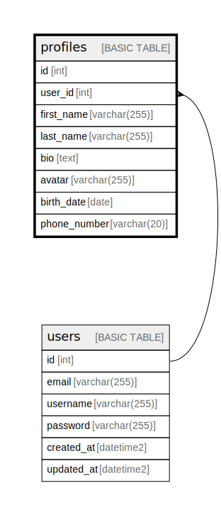

# profiles

## Description

## Columns

| Name | Type | Default | Nullable | Children | Parents | Comment |
| ---- | ---- | ------- | -------- | -------- | ------- | ------- |
| id | int |  | false |  |  |  |
| user_id | int |  | false |  | [users](users.md) |  |
| first_name | varchar(255) |  | false |  |  |  |
| last_name | varchar(255) |  | false |  |  |  |
| bio | text |  | true |  |  |  |
| avatar | varchar(255) |  | true |  |  |  |
| birth_date | date |  | true |  |  |  |
| phone_number | varchar(20) |  | true |  |  |  |

## Constraints

| Name | Type | Definition |
| ---- | ---- | ---------- |
| PK__profiles_* | PRIMARY KEY | CLUSTERED, unique, part of a PRIMARY KEY constraint, [ id ] |
| UQ__profiles_* | UNIQUE | NONCLUSTERED, unique, part of a UNIQUE constraint, [ user_id ] |
| FK__profiles__user_i_* | FOREIGN KEY | FOREIGN KEY(user_id) REFERENCES users(id) ON UPDATE NO_ACTION ON DELETE NO_ACTION |

## Indexes

| Name | Definition |
| ---- | ---------- |
| PK__profiles_* | CLUSTERED, unique, part of a PRIMARY KEY constraint, [ id ] |
| UQ__profiles_* | NONCLUSTERED, unique, part of a UNIQUE constraint, [ user_id ] |

## Relations

---

> Generated by [tbls](https://github.com/k1LoW/tbls)
