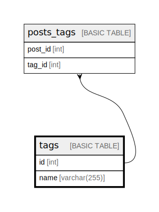

# tags

## Description

## Columns

| Name | Type | Default | Nullable | Children | Parents | Comment |
| ---- | ---- | ------- | -------- | -------- | ------- | ------- |
| id | int |  | false | [posts_tags](posts_tags.md) |  |  |
| name | varchar(255) |  | false |  |  |  |

## Constraints

| Name | Type | Definition |
| ---- | ---- | ---------- |
| PK__tags_* | PRIMARY KEY | CLUSTERED, unique, part of a PRIMARY KEY constraint, [ id ] |
| UQ__tags_* | UNIQUE | NONCLUSTERED, unique, part of a UNIQUE constraint, [ name ] |

## Indexes

| Name | Definition |
| ---- | ---------- |
| PK__tags_* | CLUSTERED, unique, part of a PRIMARY KEY constraint, [ id ] |
| UQ__tags_* | NONCLUSTERED, unique, part of a UNIQUE constraint, [ name ] |

## Relations

---

> Generated by [tbls](https://github.com/k1LoW/tbls)
