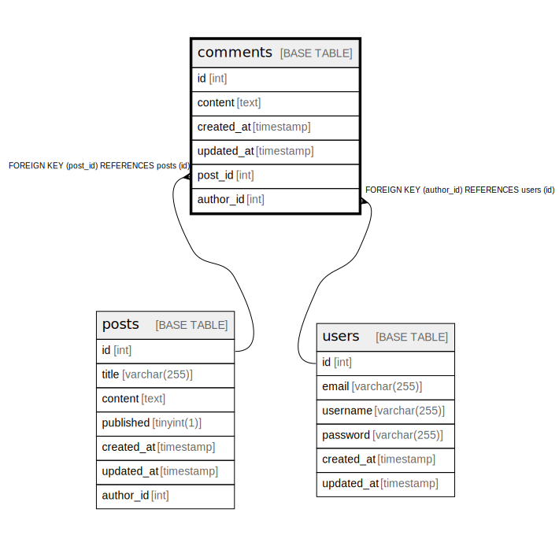

# comments

## Description

<details>
<summary><strong>Table Definition</strong></summary>

```sql
CREATE TABLE `comments` (
  `id` int NOT NULL AUTO_INCREMENT,
  `content` text NOT NULL,
  `created_at` timestamp NULL DEFAULT CURRENT_TIMESTAMP,
  `updated_at` timestamp NULL DEFAULT CURRENT_TIMESTAMP ON UPDATE CURRENT_TIMESTAMP,
  `post_id` int NOT NULL,
  `author_id` int NOT NULL,
  PRIMARY KEY (`id`),
  KEY `post_id` (`post_id`),
  KEY `author_id` (`author_id`),
  CONSTRAINT `comments_ibfk_1` FOREIGN KEY (`post_id`) REFERENCES `posts` (`id`),
  CONSTRAINT `comments_ibfk_2` FOREIGN KEY (`author_id`) REFERENCES `users` (`id`)
) ENGINE=InnoDB DEFAULT CHARSET=utf8mb4 COLLATE=utf8mb4_0900_ai_ci
```

</details>

## Columns

| Name | Type | Default | Nullable | Extra Definition | Children | Parents | Comment |
| ---- | ---- | ------- | -------- | ---------------- | -------- | ------- | ------- |
| id | int |  | false | auto_increment |  |  |  |
| content | text |  | false |  |  |  |  |
| created_at | timestamp | CURRENT_TIMESTAMP | true | DEFAULT_GENERATED |  |  |  |
| updated_at | timestamp | CURRENT_TIMESTAMP | true | DEFAULT_GENERATED on update CURRENT_TIMESTAMP |  |  |  |
| post_id | int |  | false |  |  | [posts](posts.md) |  |
| author_id | int |  | false |  |  | [users](users.md) |  |

## Constraints

| Name | Type | Definition |
| ---- | ---- | ---------- |
| comments_ibfk_1 | FOREIGN KEY | FOREIGN KEY (post_id) REFERENCES posts (id) |
| comments_ibfk_2 | FOREIGN KEY | FOREIGN KEY (author_id) REFERENCES users (id) |
| PRIMARY | PRIMARY KEY | PRIMARY KEY (id) |

## Indexes

| Name | Definition |
| ---- | ---------- |
| author_id | KEY author_id (author_id) USING BTREE |
| post_id | KEY post_id (post_id) USING BTREE |
| PRIMARY | PRIMARY KEY (id) USING BTREE |

## Relations



---

> Generated by [tbls](https://github.com/k1LoW/tbls)
