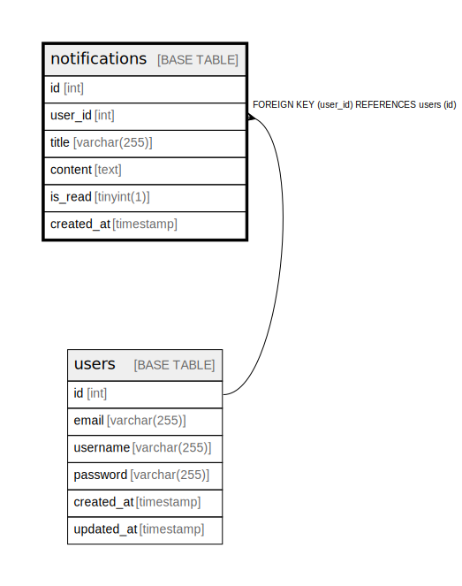

# notifications

## Description

<details>
<summary><strong>Table Definition</strong></summary>

```sql
CREATE TABLE `notifications` (
  `id` int NOT NULL AUTO_INCREMENT,
  `user_id` int NOT NULL,
  `title` varchar(255) NOT NULL,
  `content` text NOT NULL,
  `is_read` tinyint(1) DEFAULT '0',
  `created_at` timestamp NULL DEFAULT CURRENT_TIMESTAMP,
  PRIMARY KEY (`id`),
  KEY `user_id` (`user_id`),
  CONSTRAINT `notifications_ibfk_1` FOREIGN KEY (`user_id`) REFERENCES `users` (`id`)
) ENGINE=InnoDB DEFAULT CHARSET=utf8mb4 COLLATE=utf8mb4_0900_ai_ci
```

</details>

## Columns

| Name | Type | Default | Nullable | Extra Definition | Children | Parents | Comment |
| ---- | ---- | ------- | -------- | ---------------- | -------- | ------- | ------- |
| id | int |  | false | auto_increment |  |  |  |
| user_id | int |  | false |  |  | [users](users.md) |  |
| title | varchar(255) |  | false |  |  |  |  |
| content | text |  | false |  |  |  |  |
| is_read | tinyint(1) | 0 | true |  |  |  |  |
| created_at | timestamp | CURRENT_TIMESTAMP | true | DEFAULT_GENERATED |  |  |  |

## Constraints

| Name | Type | Definition |
| ---- | ---- | ---------- |
| notifications_ibfk_1 | FOREIGN KEY | FOREIGN KEY (user_id) REFERENCES users (id) |
| PRIMARY | PRIMARY KEY | PRIMARY KEY (id) |

## Indexes

| Name | Definition |
| ---- | ---------- |
| user_id | KEY user_id (user_id) USING BTREE |
| PRIMARY | PRIMARY KEY (id) USING BTREE |

## Relations



---

> Generated by [tbls](https://github.com/k1LoW/tbls)
