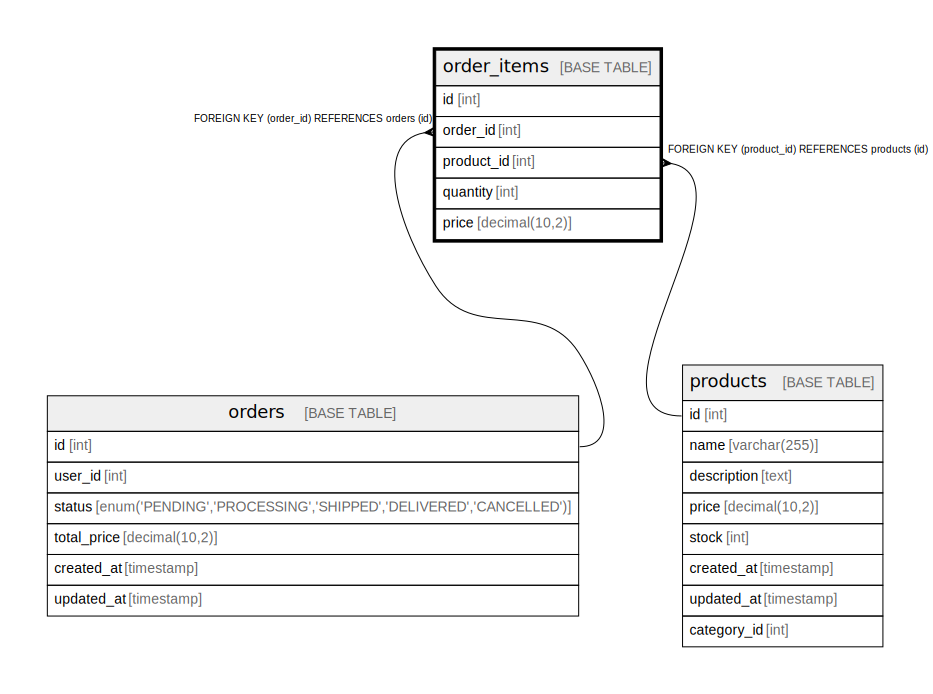

# order_items

## Description

<details>
<summary><strong>Table Definition</strong></summary>

```sql
CREATE TABLE `order_items` (
  `id` int NOT NULL AUTO_INCREMENT,
  `order_id` int NOT NULL,
  `product_id` int NOT NULL,
  `quantity` int NOT NULL,
  `price` decimal(10,2) NOT NULL,
  PRIMARY KEY (`id`),
  KEY `order_id` (`order_id`),
  KEY `product_id` (`product_id`),
  CONSTRAINT `order_items_ibfk_1` FOREIGN KEY (`order_id`) REFERENCES `orders` (`id`),
  CONSTRAINT `order_items_ibfk_2` FOREIGN KEY (`product_id`) REFERENCES `products` (`id`)
) ENGINE=InnoDB DEFAULT CHARSET=utf8mb4 COLLATE=utf8mb4_0900_ai_ci
```

</details>

## Columns

| Name | Type | Default | Nullable | Extra Definition | Children | Parents | Comment |
| ---- | ---- | ------- | -------- | ---------------- | -------- | ------- | ------- |
| id | int |  | false | auto_increment |  |  |  |
| order_id | int |  | false |  |  | [orders](orders.md) |  |
| product_id | int |  | false |  |  | [products](products.md) |  |
| quantity | int |  | false |  |  |  |  |
| price | decimal(10,2) |  | false |  |  |  |  |

## Constraints

| Name | Type | Definition |
| ---- | ---- | ---------- |
| order_items_ibfk_1 | FOREIGN KEY | FOREIGN KEY (order_id) REFERENCES orders (id) |
| order_items_ibfk_2 | FOREIGN KEY | FOREIGN KEY (product_id) REFERENCES products (id) |
| PRIMARY | PRIMARY KEY | PRIMARY KEY (id) |

## Indexes

| Name | Definition |
| ---- | ---------- |
| order_id | KEY order_id (order_id) USING BTREE |
| product_id | KEY product_id (product_id) USING BTREE |
| PRIMARY | PRIMARY KEY (id) USING BTREE |

## Relations



---

> Generated by [tbls](https://github.com/k1LoW/tbls)
