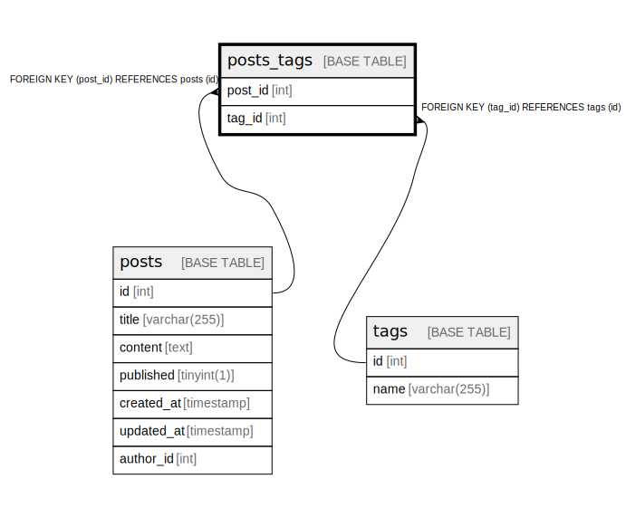

# posts_tags

## Description

<details>
<summary><strong>Table Definition</strong></summary>

```sql
CREATE TABLE `posts_tags` (
  `post_id` int NOT NULL,
  `tag_id` int NOT NULL,
  PRIMARY KEY (`post_id`,`tag_id`),
  KEY `tag_id` (`tag_id`),
  CONSTRAINT `posts_tags_ibfk_1` FOREIGN KEY (`post_id`) REFERENCES `posts` (`id`),
  CONSTRAINT `posts_tags_ibfk_2` FOREIGN KEY (`tag_id`) REFERENCES `tags` (`id`)
) ENGINE=InnoDB DEFAULT CHARSET=utf8mb4 COLLATE=utf8mb4_0900_ai_ci
```

</details>

## Columns

| Name | Type | Default | Nullable | Children | Parents | Comment |
| ---- | ---- | ------- | -------- | -------- | ------- | ------- |
| post_id | int |  | false |  | [posts](posts.md) |  |
| tag_id | int |  | false |  | [tags](tags.md) |  |

## Constraints

| Name | Type | Definition |
| ---- | ---- | ---------- |
| posts_tags_ibfk_1 | FOREIGN KEY | FOREIGN KEY (post_id) REFERENCES posts (id) |
| posts_tags_ibfk_2 | FOREIGN KEY | FOREIGN KEY (tag_id) REFERENCES tags (id) |
| PRIMARY | PRIMARY KEY | PRIMARY KEY (post_id, tag_id) |

## Indexes

| Name | Definition |
| ---- | ---------- |
| tag_id | KEY tag_id (tag_id) USING BTREE |
| PRIMARY | PRIMARY KEY (post_id, tag_id) USING BTREE |

## Relations



---

> Generated by [tbls](https://github.com/k1LoW/tbls)
