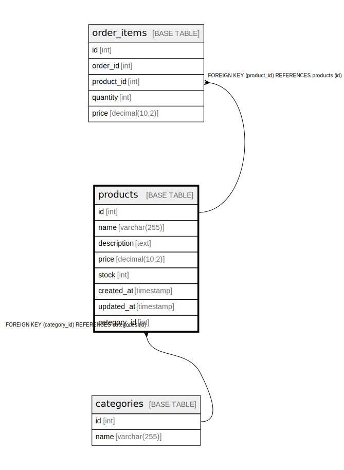

# products

## Description

<details>
<summary><strong>Table Definition</strong></summary>

```sql
CREATE TABLE `products` (
  `id` int NOT NULL AUTO_INCREMENT,
  `name` varchar(255) NOT NULL,
  `description` text NOT NULL,
  `price` decimal(10,2) NOT NULL,
  `stock` int NOT NULL,
  `created_at` timestamp NULL DEFAULT CURRENT_TIMESTAMP,
  `updated_at` timestamp NULL DEFAULT CURRENT_TIMESTAMP ON UPDATE CURRENT_TIMESTAMP,
  `category_id` int NOT NULL,
  PRIMARY KEY (`id`),
  KEY `category_id` (`category_id`),
  CONSTRAINT `products_ibfk_1` FOREIGN KEY (`category_id`) REFERENCES `categories` (`id`)
) ENGINE=InnoDB DEFAULT CHARSET=utf8mb4 COLLATE=utf8mb4_0900_ai_ci
```

</details>

## Columns

| Name | Type | Default | Nullable | Extra Definition | Children | Parents | Comment |
| ---- | ---- | ------- | -------- | ---------------- | -------- | ------- | ------- |
| id | int |  | false | auto_increment | [order_items](order_items.md) |  |  |
| name | varchar(255) |  | false |  |  |  |  |
| description | text |  | false |  |  |  |  |
| price | decimal(10,2) |  | false |  |  |  |  |
| stock | int |  | false |  |  |  |  |
| created_at | timestamp | CURRENT_TIMESTAMP | true | DEFAULT_GENERATED |  |  |  |
| updated_at | timestamp | CURRENT_TIMESTAMP | true | DEFAULT_GENERATED on update CURRENT_TIMESTAMP |  |  |  |
| category_id | int |  | false |  |  | [categories](categories.md) |  |

## Constraints

| Name | Type | Definition |
| ---- | ---- | ---------- |
| PRIMARY | PRIMARY KEY | PRIMARY KEY (id) |
| products_ibfk_1 | FOREIGN KEY | FOREIGN KEY (category_id) REFERENCES categories (id) |

## Indexes

| Name | Definition |
| ---- | ---------- |
| category_id | KEY category_id (category_id) USING BTREE |
| PRIMARY | PRIMARY KEY (id) USING BTREE |

## Relations



---

> Generated by [tbls](https://github.com/k1LoW/tbls)
